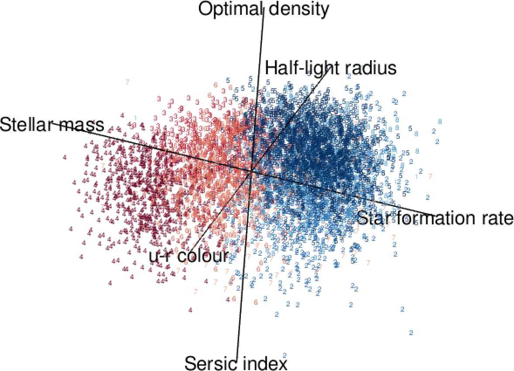
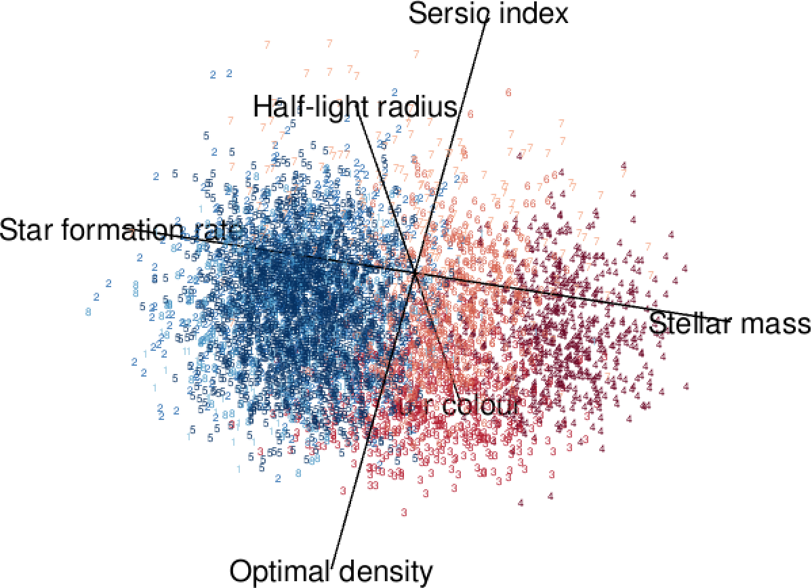

```{r setup, include = FALSE}
knitr::opts_chunk$set(
  warning = FALSE, message = FALSE, error = FALSE,
  collapse = TRUE, comment = "#>", out.width = "100%",
  fig.path = "figures/"
)
```

This project uses a $t$-mixture of factor analyzers and a model-estimated overlap-based syncytial clustering approach to cluster and characterize galaxy data from the Galaxy And Mass Assembly (GAMA) survey. Each galaxy is represented by five intrinsic variables—stellar mass, specific star formation rate, $u−r$ color, half-light radius, and S\'ersic index—and one environmental variable, the optimal density, which captures the influence of the local environment.

The following figures present the estimated clusters from the model-based clustering (MBC) analysis. The 3D star-coordinate plot illustrates the separation of the two major galaxy populations, the red and blue sequences, and the distribution plots reveal distinct patterns in the variables across the identified galaxy clusters.

<div style="display: flex; justify-content: center; align-items: flex-start; gap: 24px; margin: 20px 0;">
  
  <div style="display: flex; flex-direction: column; gap: 16px;">
    
    
  </div>
  
  <div>
    
  </div>

</div>

